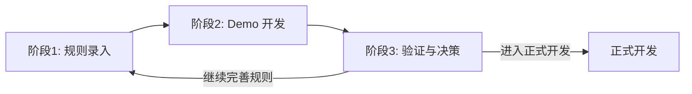
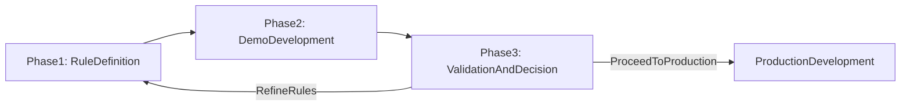
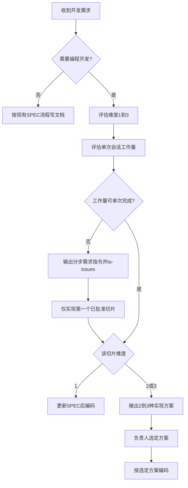

# SPEC_01 — 开发流程与协作约定 / Development Workflow（Gravedigger2026）

**关联文档 / Related:** [SPEC_00_Index.md](SPEC_00_Index.md)

> 本文件对齐公共套件 `SPECandSKILL\SPEC\SPEC_01_Workflow.md`。  
> 项目名：**Gravedigger2026**。套件专属目录：`F:\CursorGame_Git\SPECandSKILL\Gravedigger2026\`。  
> 日常开发以工作区根已复制的本文件为准；流程变更请同步回套件。

---

## 1. 总体流程

### 简体中文

采用三阶段迭代式开发流程：

1. **规则录入阶段** — 负责人逐步阐述规则；助手结构化写入 SPEC；负责人确认或修正。
2. **Demo 开发阶段** — 规则达到可开发 Demo 的完整度，且负责人**明确要求**时，才开始编程；**必须先更新 SPEC，再写代码**。
3. **验证与决策阶段** — 负责人验证 Demo；结论同步写入 SPEC，再决定是否进入正式开发。

### English

Three-phase iterative workflow:

1. **Rule Definition** — Owner describes rules; assistant records them in SPEC; owner confirms.
2. **Demo Development** — Coding starts only when rules are sufficient **and** the owner **explicitly requests** it; **SPEC must be updated before any code**.
3. **Validation & Decision** — Owner validates Demo; record outcomes in SPEC; decide on production.

---

## 2. 阶段 1：规则录入

### 简体中文

**目标：** 将口头/文字规则转化为结构化、可执行的 SPEC。

**流程：**
1. 负责人发送规则描述（可分批）。
2. 助手更新 [SPEC_03_GameRules.md](SPEC_03_GameRules.md) 及相关章节（中英文同步）。
3. 在 [SPEC_00_Index.md](SPEC_00_Index.md) Changelog 记录变更。
4. 回复：已写章节、待澄清项。
5. 负责人确认或修正；冲突以最新 SPEC 为准。

**本阶段禁止：** 编写游戏代码或创建游戏资源（除非负责人明确要求紧急跳过 SPEC，且事后须补写）。

### English

**Goal:** Convert verbal/written rules into structured SPEC.

**Process:** Owner describes → assistant updates SPEC_03 (+ related) bilingually → Changelog → reply with sections/open questions → owner confirms.

**Prohibited:** Writing game code or assets (unless owner authorizes an emergency skip; SPEC must be backfilled afterward).

---

## 3. 阶段 2：Demo 开发

### 简体中文

**启动条件（须同时满足）：**
- SPEC_03 中「Demo 验收标准」已定义且足够具体。
- 负责人**明确发出**「开始 Demo 开发」指令。
- 相关技术约定已在 SPEC_04 就位。

**开发原则：**
- 严格按 SPEC 实现；未写入 SPEC 的需求不纳入 Demo。
- 实现中发现设计问题：先更新 SPEC，再改代码。
- Demo 以验证核心玩法为目标，不追求完整内容与 polish。

### English

**Start conditions:** Demo acceptance criteria ready + explicit owner go-ahead + SPEC_04 conventions in place.

**Principles:** Implement only what is in SPEC; update SPEC before code when design issues appear; validate core gameplay, not polish.

---

## 4. 阶段 3：验证与决策

### 简体中文

1. 对照 SPEC_03 Demo 验收标准逐项验证。
2. 记录通过 / 部分通过 / 未通过及问题。
3. 未通过 → 修正 SPEC 与/或 Demo；通过 → 决定是否正式开发并写入 SPEC。
4. 结论写入 Changelog 与相应章节。

### English

Validate against Demo acceptance criteria; record outcomes; revise or proceed to production; log in Changelog.

---

## 5. 协作约定

### 简体中文

| 约定 | 说明 |
|------|------|
| SPEC 优先 | 所有开发需求必须先更新 SPEC，再进行代码开发 |
| 单一权威 | 规则冲突时以最新 SPEC 为准 |
| 范围边界 | 未写入 SPEC 的需求不纳入开发范围 |
| 双语同步 | 每次 SPEC 更新须同步中英文两块 |
| 变更可追溯 | 每次变更在 Changelog 中记录日期与摘要 |
| Demo 范围明确 | Demo 实现边界在 SPEC_03 验收章节单独列出 |
| 编程难度分级 | 编码前评估 1~3 级；2/3 级须先比选实现方案（§7） |
| 编码前工作量预估 | 编码前评估单次会话工作量；须拆步时输出分步指令并走 `/to-issues`（§7.5） |

### English

| Convention | Description |
|------------|-------------|
| SPEC first | Update SPEC before coding |
| Single source of truth | Latest SPEC prevails |
| Scope boundary | Out-of-SPEC requirements are excluded |
| Bilingual sync | Update both language blocks |
| Traceable changes | Log every change in Changelog |
| Clear Demo scope | Demo boundary listed in SPEC_03 acceptance section |
| Coding difficulty | Assess 1–3 before coding; levels 2/3 require approach comparison (§7) |
| Workload estimate | Assess single-session workload; split + `/to-issues` when required (§7.5) |

---

## 6. 角色与职责

### 简体中文

| 角色 | 职责 |
|------|------|
| 项目负责人 | 阐述规则、确认 SPEC、决定 Demo 启动与正式开发 |
| 开发助手 | 结构化写入 SPEC、在授权后实现 Demo、同步 Changelog |

### English

| Role | Responsibilities |
|------|------------------|
| Project owner | Describe rules, confirm SPEC, authorize Demo / production |
| Development assistant | Write SPEC, implement Demo when authorized, maintain Changelog |

---

## 7. 编程开发难度分级

### 简体中文

凡涉及代码、Prefab、ScriptableObject、场景等**编程开发**的任务，编码前须评估**难度**与**单次会话工作量**。纯 SPEC 文档编写不适用本章。

#### 7.1 难度定义（1~3 级）

| 等级 | 含义 | 判定参考 |
|------|------|----------|
| **1 — 简单** | 范围小、SPEC 已覆盖、改动集中 | 单模块、1~3 个文件；无新架构 |
| **2 — 中等** | 有一定复杂度，需跨模块或补 SPEC | 多文件；Prefab+Controller+SO 组合或状态机 |
| **3 — 困难** | 高难度；建议最强 AI 模型；**一律按 §7.5 须拆步** | 多系统联动；SPEC 缺失或模糊；核心系统重构 |

自评须附理由；**以负责人最终确认为准**。

#### 7.2 分级后的执行规则

1. 每次编程前给出自评难度与工作量及理由，由负责人确认。
2. **难度 1**（且可单次完成）：可直接编码（仍须 SPEC 优先）。
3. **难度 2/3**：禁止直接编码；须先提交 2~3 种方案，负责人选定后再开发。
4. 方案选定后若设计有变，先更新 SPEC 再改代码。
5. 若须拆步，先完成 §7.5，再对本会话切片执行难度规则。

#### 7.3 实现方案最低内容

名称与摘要、影响范围（SPEC/资源路径）、主要步骤（3~7）、优缺点与风险、与现有 SPEC/架构符合度。

#### 7.4 例外

负责人明确授权的紧急修复可跳过比选与拆步，事后须补 SPEC 并在 Changelog 标注。

#### 7.5 编码前工作量预估

| 判定 | 条件 |
|------|------|
| **可单次完成** | 预计 ≤5 个源文件/资产；单模块；无新建 Prefab+Controller+SO 整链 |
| **须拆步** | >5 文件；跨 ≥2 玩法模块；新建整链；难度 3；或逼近会话上下文上限 |

**须拆步时：** 停止整包编码 → 输出可粘贴分步需求指令 → `/to-issues` 写入 `.scratch/<feature>/issues/`（须 `spec_refs`）→ 本会话最多实现第一个已批准切片。

操作化步骤见 [unity-spec-dev-workflow](.cursor/skills/unity-spec-dev-workflow/SKILL.md) §8。

### English

Before coding (scripts, Prefabs, SOs, scenes), assess **difficulty** (1–3) and **single-session workload**. Level 2/3 require approach comparison; difficulty 3 always splits. Split → step prompts + `/to-issues`; this session implements at most the first approved slice. Details: [unity-spec-dev-workflow](.cursor/skills/unity-spec-dev-workflow/SKILL.md) §8.

---

## 8. Agent Skills 编排

### 简体中文

**权威顺序：** `SPEC_*.md` > `CONTEXT.md`（术语）> `docs/adr/`（架构决策）> [AGENTS.md](AGENTS.md)

| 阶段 / 场景 | Skill |
|-------------|-------|
| 规则模糊 | `/grill-with-docs` 或 `spec-grill-me` → SPEC + CONTEXT + Changelog |
| 规则清晰，仅写 SPEC | `unity-spec-dev-workflow` §1 |
| Demo 多任务 / 须拆步 | `/to-issues` → `.scratch/<feature>/issues/` |
| Demo 单任务编码 | `unity-spec-dev-workflow` §8 → §2 |
| 跨会话 | `/handoff` + `.scratch/handoffs/` |
| 排障 | `diagnosing-bugs` |
| 首次整合上游 skills | `matt-skills-setup` |

**禁用：** `/to-prd`（由 SPEC 承担）；上游 `/implement`（由 `unity-spec-dev-workflow` §2 承担）。

**路由：** 不确定时用 [agent-router](.cursor/skills/agent-router/SKILL.md)。

**上游 skills：** `.agents/skills/`（`npx skills@latest add mattpocock/skills`）。

### English

Authority: SPEC > CONTEXT > ADR > AGENTS. Route via [agent-router](.cursor/skills/agent-router/SKILL.md). Do not use `/to-prd` or upstream `/implement`. Upstream skills under `.agents/skills/`.
